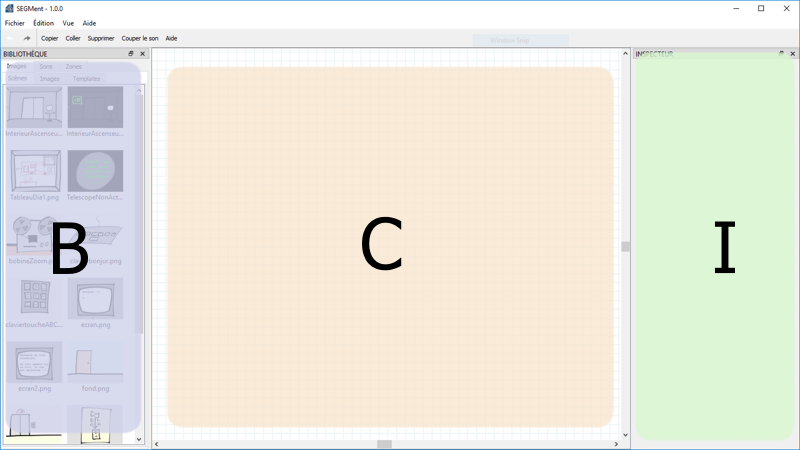
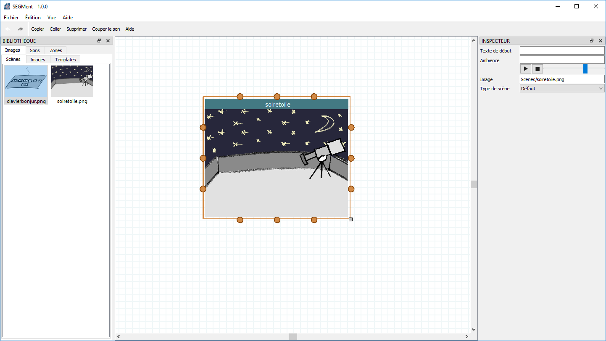
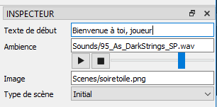
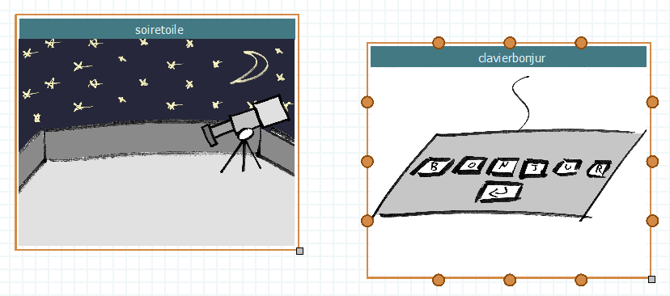
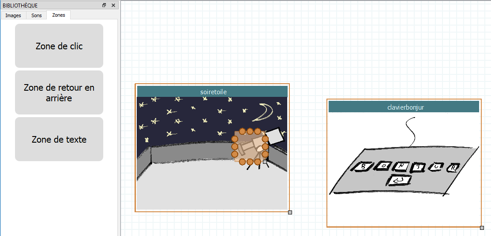
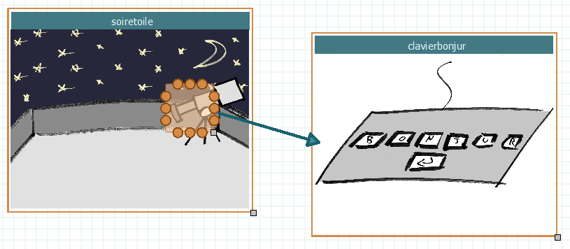
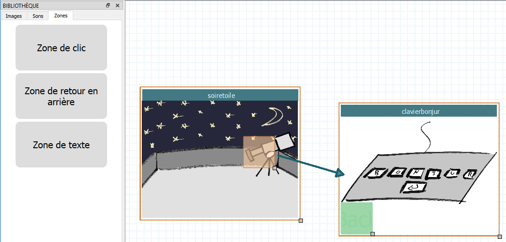
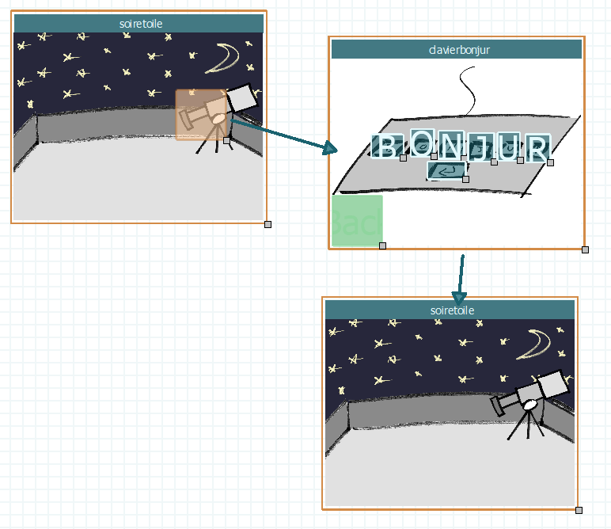
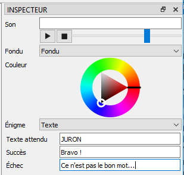

.. index:: Tutorial

Tutorial
========

Ce tutorial guide la prise en main de l'éditeur de jeu SEGMent.

Le principe de fonctionnement est le suivant:

- L'éditeur va créer un fichier de sauvegarde.
- Ce fichier va être lu par le programme SEGMent au moment de lancer le jeu.

L'éditeur est organisé en trois parties: bibliothèque, canvas, inspecteur :

La Bibliothèque est la partie de gauche et permet d'ajouter des éléments
à un jeu : scènes, objets, sons, etc.
Le Canvas est la partie principale, qui permet de définir le jeu.
L'Inspecteur permet de choisir certaines propriétés des objets du jeu :
énigmes, volume du son, etc.

Mise en place d'un jeu
----------------------

La première étape est de créer un nouveau dossier dans lequel sera stocké le jeu.

Il convient d'avoir à disposition les ressources pour la création du jeu.
Un jeu de ressources par défaut, fournies par Raphaël Marczak, se situe dans le dossier d'installation de SEGMent:
par exemple, ``C:\Program Files\SEGMent 1.0.0``.

Copier le dossier ``Ressources`` dans le dossier créé précédemment,
afin qu'il soit situé au même endroit que le fichier de sauvegarde.

Une fois cela fait, on peut sauvegarder le canvas vide dans ce nouveau dossier,
via le menu ``Fichier > Sauver sous``.

Sous Windows, cela devrait ressembler à la configuration suivante :

.. figure:: images/save.png
   :alt: Sauvegarde

Création de scènes
------------------

Une fois cette structure mise en place, il est possible de commencer à
créer le jeu.

La base d'un jeu SEGMent est la scène: une scène correspond à un endroit
auquel se trouve le joueur. En cliquant sur des objets et en résolvant des
énigmes, le joueur va passer de scène en scène, jusqu'à arriver à la fin du jeu.

Ajouter une scène se fait par glisser-déposer depuis la bibliothèque sur le canvas.
Ajoutons une première scène :

Lorsqu'elle est sélectionnée, la scène peut être redimensionnée avec la poignée
située en bas à droite, et déplacée dans le canvas via sa barre de titre.
Elle peut être supprimée avec Suppr.

Enfin, l'inspecteur affiche les propriétés de la scène, détaillées dans la documentation.
En particulier, cette scène va être fixée en tant que scène de type "initial" :
c'est là que le joueur va débuter.

Rajoutons une seconde scène :

Création d'objets
-----------------

Pour l'instant, cette scène n'est pas atteignable par le joueur.
Pour lui permettre de s'y rendre, nous allons rajouter une zone de clic dans la première scène.
Cela se fait via glisser-déposer depuis l'inspecteur :

Création de transitions
-----------------------

Enfin, nous allons créer une transition depuis la zone de clic vers la seconde scène:
il faut pour cela cliquer sur une des ancres (les points oranges) située autour de la zone
de clic, puis glisser la souris jusqu'à une ancre de la seconde scène :

La transition peut aussi être sélectionnée et configurée via l'inspecteur.

Pour pouvoir revenir en arrière depuis la seconde scène, on ajoute une zone
de retour en arrière de la même manière : elle s'affichera en vert dans l'éditeur,
et sous forme de flèche dans le jeu

Création d'énigmes
------------------

Configurons maintenant une énigme permettant au joueur d'avancer :
cette énigme va prendre la forme d'un code à taper sur la seconde scène.

Pour ce faire, on va rajouter des zones de texte sur chacunes des touches de la scène :

.. figure:: images/text.png
   :alt: Text

Chaque zone de texte peut être configurée avec une lettre en double-cliquant dessus ou via l'inspecteur.
La touche "entrée" peut être configurée avec le comportement "Valider": c'est elle qui déclenchera
l'évaluation de l'énigme.

Rajoutons une troisème scène : on crée une transition de la scène du clavier,
vers cette nouvelle scène :

L'énigme précédemment créée peut se configurer sur la transition entre
ces deux scènes, via l'inspecteur :

Enfin, cette nouvelle scène peut être configurée en type "Final" : le joueur
verra s'afficher l'écran de victoire à son issue.
