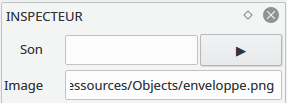
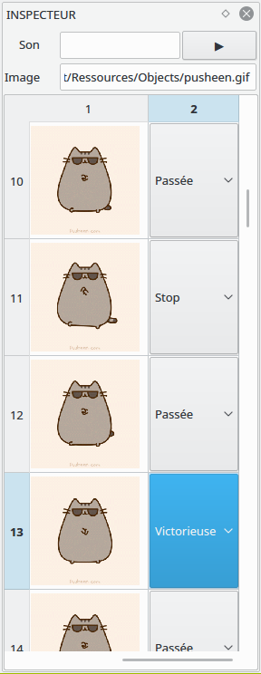
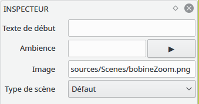
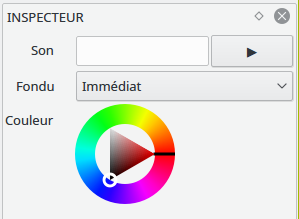
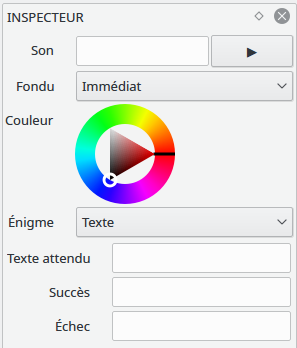

.. index:: Inspecteur

Inspecteur d’objets
===================

L’inspecteur permet de modifier les propriétés d’un élément du jeu.

Inspecteur d’image
------------------

Cet inspecteur est associé aux images simples.

Inspecteur de gif
-----------------

Cet inspecteur affiche toutes les images de la gif.
Il est possible de changer l'image par défaut en double-cliquant dessus.
Le sélecteur pour chaque image permet de choisir les trois cas suivants : 

- Stop: le jeu fera une pause sur cette image.
- Passée: l'image est passée, elle ne sert que de frame intermédiaire d'animation.
- Victorieuse: cette frame est une condition de victoire pour l'énigme de cette scène.

Inspecteur de zone de texte
---------------------------

Cet inspecteur permet de contrôler le fonctionnement d'une zone de texte.

Inspecteur de scène
-------------------

Cet inspecteur est associé aux scènes.
Une scène peut être de plusieurs types : 
- Initiale : il ne peut y en avoir qu'une: c'est le début du jeu.
- Finale : il ne peut y en avoir qu'une: c'est la scène de victoire.
- Défaut : les scènes normales.
- Game over : en cas de défaite du joueur.

Inspecteur de transition
------------------------

Les transitions ont différents inspecteurs selon les situations:

Transition d’un objet vers une scène
~~~~~~~~~~~~~~~~~~~~~~~~~~~~~~~~~~~~

Transition d’une scène vers une scène
~~~~~~~~~~~~~~~~~~~~~~~~~~~~~~~~~~~~~

Dans ce cas, une énigme est possible. 
Plusieurs types d'éngimes peuvent être choisis : 
- Pas d'énigme
- Énigme sur texte: la scène d'origine doit posséder une zone de texte. 
  On passe à la scène suivante quand le texte est valide.
- Énigme sur puzzle: le joueur doit reconstituer un puzzle dans la scène de départ.
- Énigme sur gif: le joueur doit mettre toutes les gif de la scène de départ 
en position victorieuse.

