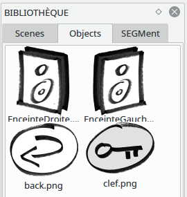
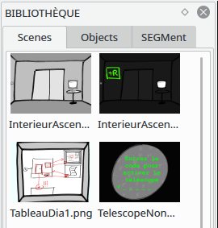
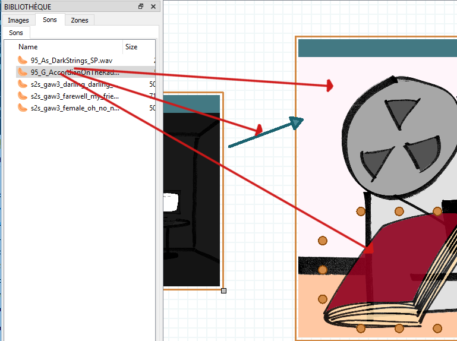
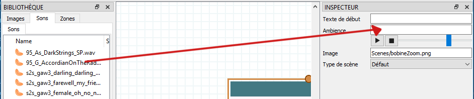
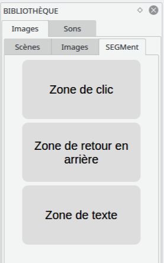

.. index:: Bibliothèque

Bibliothèque
============

La bibliothèque contient un ensemble d’éléments pouvant être
glissé-déposés dans la scène principale.

Les données de la bibliothèque sont recherchées à l’emplacement du
fichier de sauvegarde du projet, dans un sous-dossier nommé
``Ressources``.

Objets
------

Les objets sont les fichiers présents dans le dossier
``Ressources/Objects``. Ce sont les images qui peuvent être placées sur
une scène.

Si un objet possède l’icone de caméra |camera|, dans le coin supérieur
gauche, c’est qu’il s’agit d’une GIF (image animée).

Scènes
------

Les scènes sont les éléments principaux d’un jeu. Les objets sont les
fichiers présents dans le dossier ``Ressources/Scenes``.

Elles ne peuvent être déposées que sur le canvas central.

Templates
---------

Les templates sont des scènes pré-enregistrées, situées dans le dossier
``Ressources/Templates``.
Une scène template peut être ajoutée à la bibliothèque via le menu du
clic droit sur l'en-tête d'une scène.
Une scène template peut être supprimée de la bibliothèque via la touche
Suppr. (sur Windows & Linux) ou Backspace (sur Mac).

Sons
----

Les objets sont les fichiers présents dans le dossier
``Ressources/Sounds``. Ils peuvent être glissé-déposé sur de nombreux
éléments d'un canvas SEGMent : scènes, images, transitions...

Ils peuvent aussi être glissé-déposé sur l'inspecteur d'un objet :

Il est possible d'écouter un son dans la bibliothèque en double-cliquant dessus.

Zones spéciales
---------------

Ces zones ne sont pas des images, elles possèdent un comportement
spécifique dans le jeu.

Zone de clic
~~~~~~~~~~~~

La zone de clic indique un endroit ou le joueur peut cliquer sur une scène;
elle ne sera pas visible dans le jeu.

Zone de retour en arrière
~~~~~~~~~~~~~~~~~~~~~~~~~

La zone de retour en arrière indique un endroit ou le joueur peut cliquer
pour revenir à la scène précédente.

Zone de texte
~~~~~~~~~~~~~

La zone de texte indique un endroit ou le joueur peut saisir du texte.

Énigmes
-------

Ces boutons permettent d'activer un type d'énigme sur une transition.
On rappelle que les énigmes ne sont valables que sur les transitions entre
scènes (oranges).

Pour activer une énigme, il faut réaliser un glisser-déposer de l'énigme vers
la transition.
L'énigme peut ensuite être configurée depuis l'inspecteur de la transition.

