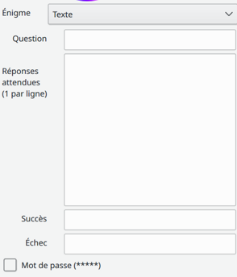
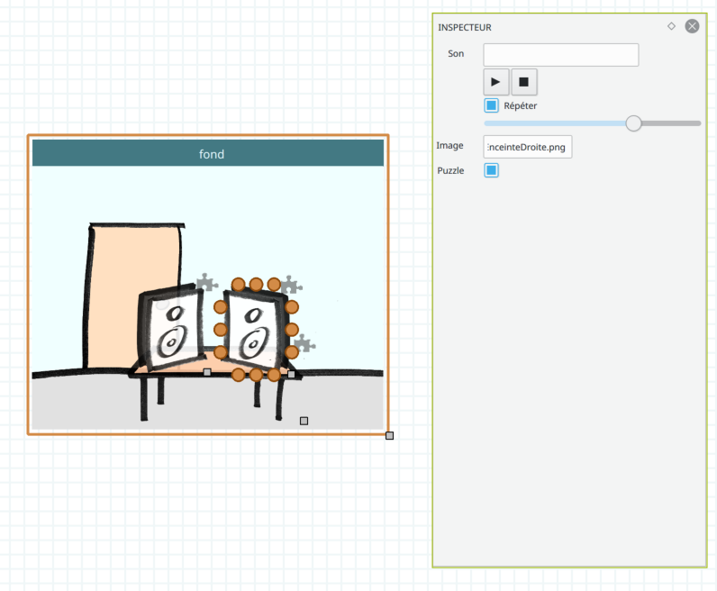
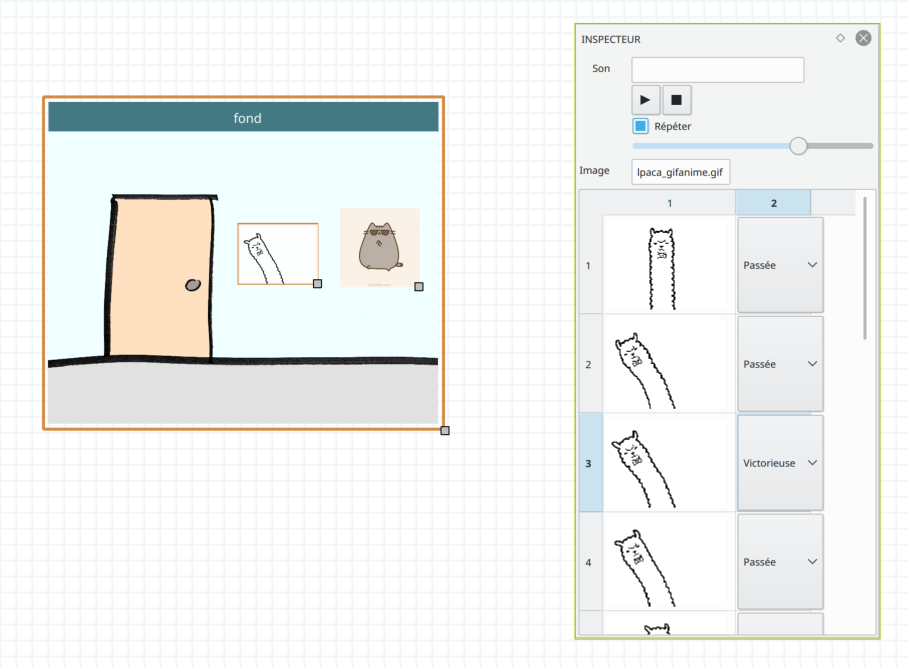

.. index:: Énigmes

Énigmes
=======

Il y a trois sortes d'énigmes :

 - Énigmes de texte
 - Puzzles
 - Gifs

Énigmes de texte
----------------

Ces énigmes demande au joueur de rentrer un texte.
Il y a deux possibilités :

 - Soit avec le clavier de l'ordinateur, ce qui permet au joueur de taper ce qu'il veut.
   C'est le comportement par défaut s'il n'y a pas de zone de texte.
 - Soit avec des zones de texte, ce qui restreint les caractères possibles à ceux rajoutés.

L'inspecteur de cette énigme propose plusieurs fonctionnalités :

- Question: la question posée au joueur, affichée dans le champ de texte
- Réponses attendues: les réponses valables. Plusieurs réponses sont possibles, il faut sauter une ligne pour chaque réponse.
- Succès: texte affiché une fois que l'énigme a été résolue.
- Échec: texte affiché si le joueur rentre une mauvaise réponse.

Puzzles
-------

Pour ce type d'énigme, le joueur doit repositionner les objets approximativement comme ils ont été positionnés
dans l'éditeur.
Le jeu mélange les pièces automatiquement.

Les pièces de puzzle sont celles marquées ainsi dans l'inspecteur :

Toute image peut faire partie d'un puzzle. Une icône de pièce de puzzle s'affichera dans le coin supérieur
droit des pièces de puzzle d'une scène.

Gifs
----

Pour ce type d'énigme, le joueur doit mettre toutes les gifs de la scène d'origine de l'énigme
sur une position dite "victorieuse" en cliquant dessus.
Ces positions se configurent dans l'inspecteur.

