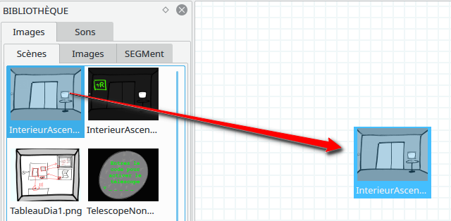
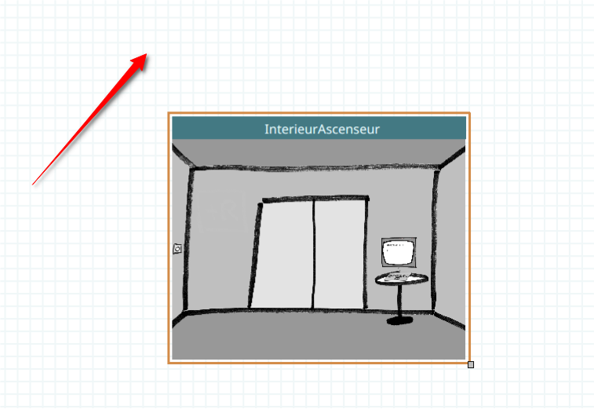
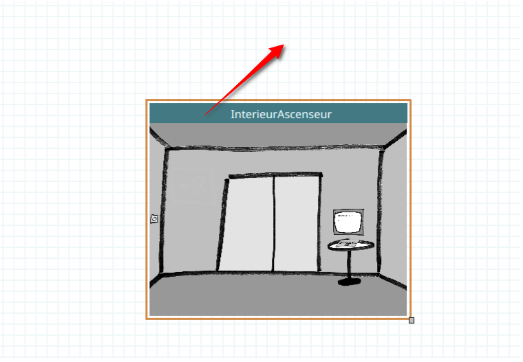
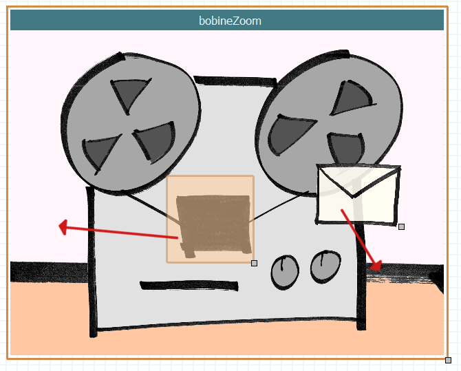
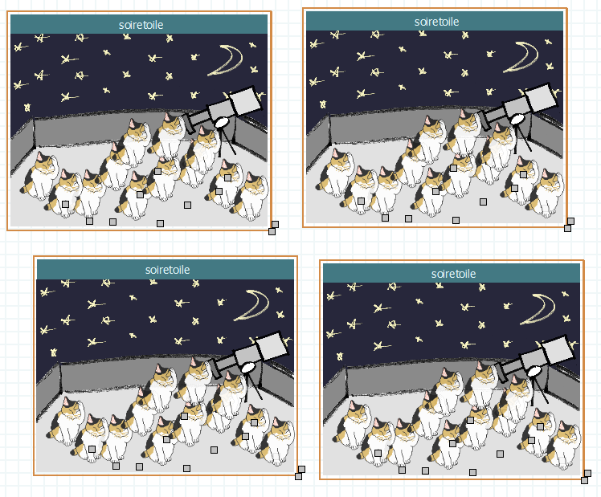
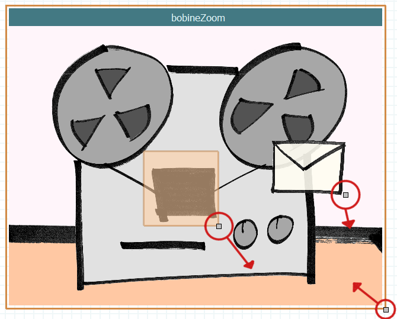
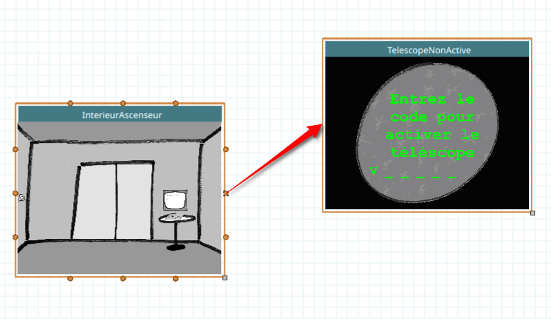
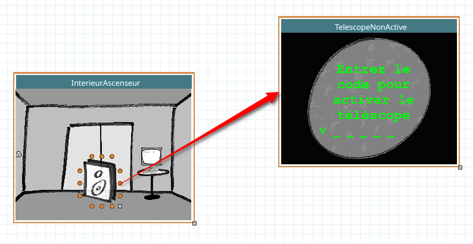

.. index:: Canvas

Canvas
======

Le canvas est l'élément central de l'éditeur SEGMent: c'est la partie
ou les scènes du jeu sont disposées et reliées entre elles.

Plusieurs interactions sont possibles dans le canvas.

Ajouter de nouvelles scènes
---------------------------

Cela se fait via glisser-déposer depuis l'inspecteur.

Se déplacer dans le canvas
--------------------------

Deux possibilités : en déplaçant le fond avec la souris, ou bien avec
les barres de défilement à droite et en bas du canvas.

Changer le niveau de zoom
-------------------------

Cela se fait en utilisant Ctrl + la molette de la souris,
ou bien Cmd (touche pomme) + mouvement du trackpad selon le matériel utilisé.

Déplacer des éléments du canvas
-------------------------------

Pour les scènes, cela se fait en déplaçant leur barre de titre.

Pour tous les autres objets, ils peuvent être déplacés simplement en les bougeant
avec la souris :

Créer des objets
----------------

Cela se fait via glisser-déposer depuis l'inspecteur vers une scène.

.. figure:: images/create-object.png
   :alt: Scene drag

Copier des scènes et des objets
-------------------------------

Cela se fait via les raccourcis standards : Ctrl-C / Ctrl-V ou Cmd-C / Cmd-V sur Mac.

Redimensionner des scènes et des objets
---------------------------------------

Cela se fait en glissant-déplaçant la poignée grise située en bas à droite
des objets: scènes, images, etc.

Créer des transitions
---------------------

Cela se fait en sélectionnant une ancre autour d'un objet, puis en
effectuant un glisser-déposer vers une ancre d'une autre scène.

Il est possible de créer des transitions depuis certains objets vers des
scènes.

Les transitions de scène à scène sont affichées en orange, tandis que
les transitions de scène à objet sont affichées en bleu.

Supprimer des objets
--------------------

Cela se fait en effectuant un clic-droit sur l'objet et en sélectionnant
"Supprimer" dans le menu.
Il est aussi possible d'utiliser la touche supprimer (sous Windows ou Linux)
ou Backspace (sous Mac).

